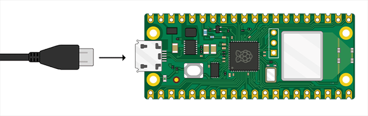
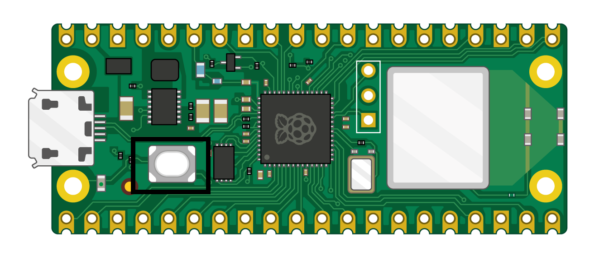
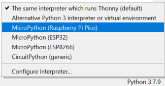
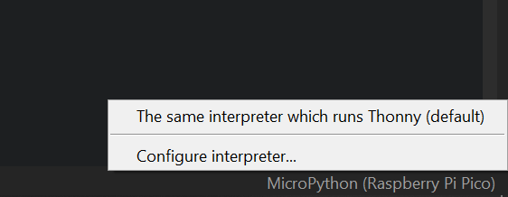
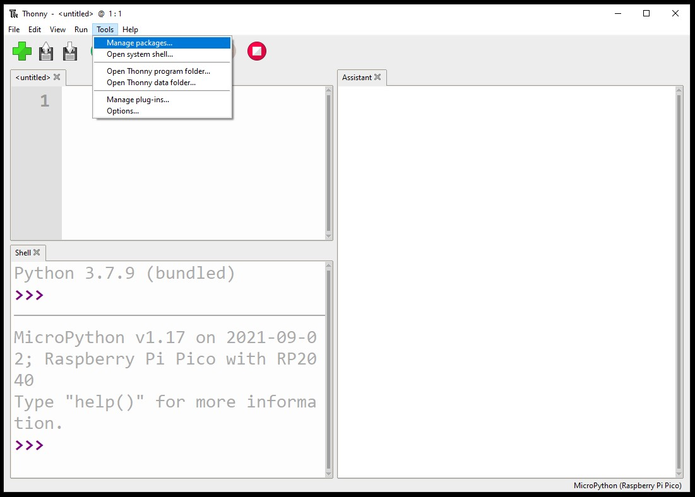
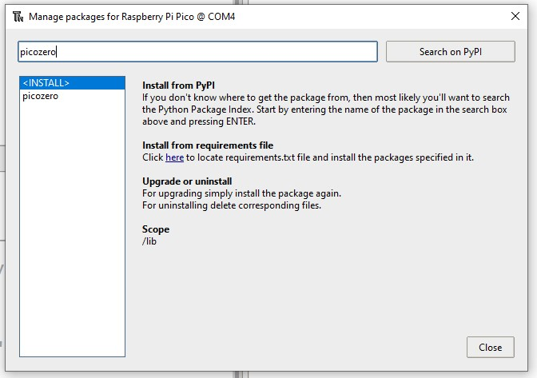
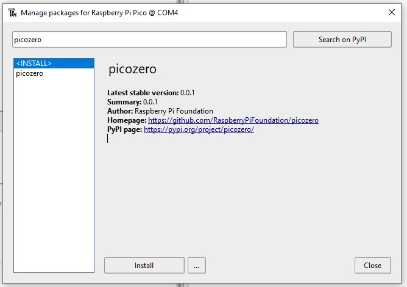

## Nastav si Raspberry Pi Pico W

Připoj svůj Raspberry Pi Pico W a nastav MicroPython.

MicroPython je verze programovacího jazyka Pythonu pro mikrořadiče, jako je například váš Raspberry Pi Pico W. MicroPython ti umožní použít znalosti Pythonu k psaní kódu pro interakci s elektronickými komponenty.

--- task ---

Stáhni si nejnovější verzi Raspberry Pi Pico W firmware na [https://rpf.io/pico-w-firmware](https://rpf.io/pico-w-firmware)

--- /task ---

--- task ---

**Připoj** menší konec kabelu micro USB k Raspberry Pi Pico W.

--- /task ---

--- task ---

Podrž stisknuté tlačítko **BOOTSEL** na Raspberry Pi Pico W.

--- /task ---

--- task ---

**Připoj** druhý konec tvého stolního počítače, notebooku nebo Raspberry Pi.

--- /task ---

--- task ---

Měl by se otevřít správce souborů, kde by se Raspberry Pi Pico mělo zobrazit jako externě připojený disk. Přetáhni stažený soubor firmwaru do správce souborů. Raspberry Pi Pico by se mělo odpojit a správce souborů by se měl zavřít.

--- /task ---

--- task ---

Otevři editor Thonny.

--- /task ---

--- task ---

Podívej se na text v pravém dolním rohu editoru Thonny. Zobrazí se ti používaná verze Pythonu.

Pokud tam **není** uvedeno „MicroPython (Raspberry Pi Pico)“, klikni na text a z možností vyber „MicroPython (Raspberry Pi Pico)“.

--- /task ---

--- task ---

**Debug:**

--- collapse ---
---
title: Nevím, jestli je firmware nainstalovaný a nemohu se připojit k mému Picu
---

Ujisti se, že je Raspberry Pi Pico W připojeno k počítači pomocí micro USB kabelu. Klikněte na seznam v pravém dolním rohu okna Thonny. Zobrazí se vyskakovací menu, která obsahuje seznam dostupných interpretů.

Pokud Pico v seznamu nevidíš (jak je znázorněno na obrázku), je třeba Raspberry Pi Pico W znovu připojit, přičemž podrž tlačítko BOOTSEL, abys jej připojil jako úložný svazek, a poté znovu nainstalovat firmware podle pokynů ve výše uvedené části.

--- /collapse ---

--- collapse ---
---
title: Firmware je nainstalován, ale stále se nemohu připojit k Picu
---

Možná používáš nesprávný typ micro USB kabelu. Tvůj současný micro USB kabel může být poškozen nebo navržen pouze pro přenos energie do zařízení, nikoli pro přenos dat. Zkus vyměnit svůj kabel za jiný, pokud nic nefunguje.

Pokud se Pico po pokusu o všechny tyto věci stále nepřipojí, může být **samo** poškozeno a proto se nemůže připojit.

--- /collapse ---

--- /task ---

Pro nováčky s Raspberry Pi Pico je tu knihovna `picozero` v MicroPythonu, která je vhodná pro začátečníky.

--- task ---

Pro dokončení projektů v této cestě je třeba nainstalovat knihovnu `picozero` jako balíček Thonny.

V Thonny zvol **Nástroje** > **Spravovat balíky**.

--- /task ---

--- task ---

Ve vyskakovacím okně "Spravovat balíčky pro Raspberry Pi Pico" zadejte `picozero` a klikněte na **Hledat na PyPi**.

--- /task ---

--- task ---

Klikněte na **picozero** ve výsledcích vyhledávání.

Klikni na **Instalovat**.

Po dokončení instalace zavři okno balíku, poté zavři a znovu otevři Thonny.

--- /task ---

Pokud máš potíže s instalací knihovny `picozero` v Thonny, můžeš stáhnout soubor knihovny a uložit jej do svého Raspberry Pi Pico W.

[[[picozero-offline-install]]]
