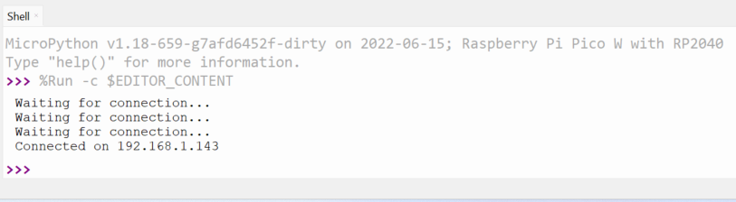

## Připoj Raspberry Pi Pico W k WLAN síti

Zde se naučíš používat MicroPython k připojení Raspberry Pi Pico W k bezdrátové lokální síti (WLAN), častěji známá jako WiFi síť.

{:width="300px"}

Hesla je třeba uchovávat bezpečně a v soukromí. V tomto kroku přidáš heslo k WiFi do souboru Pythonu. Ujisti se, že svůj soubor nesdílíš s nikým, komu nechceš sdělit své heslo.

Chceš-li se připojit k síti WiFi, musíš znát identifikátor své služby (SSID). Toto je název WiFi sítě. Také budeš potřebovat heslo k WiFi. Tyto kódy obvykle najdeš napsané na bezdrátovém routeru, i když byste měli změnit výchozí heslo na něco jedinečného.

--- task ---

V Thonny importuješ balíčky, které budeš potřebovat pro připojení k WiFi síti, načtení integrovaného teplotního senzoru a rozsvícení integrované LED diody.

--- code ---
---
language: python
filename: web_server.py
line_numbers: true
line_number_start:
line_highlights:
---
import network
import socket
from time import sleep
from picozero import pico_temp_sensor, pico_led
import machine
import rp2
import sys

--- /code ---

Ulož si tento kód a vyber možnost uložení do **Tento počítač**

--- /task ---

--- task ---

Dále nastav Raspberry Pi Pico W tak, aby používalo integrovanou LED diodu, a navíc přidej SSID a heslo pro vaši síť.

--- code ---
---
language: python
filename: web_server.py
line_numbers: true
line_number_start: 9
line_highlights: 
---
ssid = 'NÁZEV VAŠÍ WIFI SÍTĚ'
password = 'VAŠE TAJNÉ HESLO'

--- /code ---

--- /task ---

--- task ---

Nyní začni vytvářet funkci pro připojení k vaší WLAN síti. Je třeba nastavit objekt `wlan`, aktivovat bezdrátové připojení a poskytnout objektu vaše `ssid` a `password`.

--- code ---
---
language: python
filename: web_server.py
line_numbers: true
line_number_start: 14
line_highlights: 
---
def connect():
    # Připojení k WLAN
    wlan = network.WLAN(network.STA_IF)
    wlan.active(True)
    wlan.connect(ssid, password)

--- /code ---

--- /task ---

--- task ---

Pokud jsi někdy připojil zařízení k síti WiFi, budeš vědět, že se to nestane okamžitě. Tvé zařízení bude odesílat žádosti na WiFi router pro připojení a po odpovědi routeru, vykoná to, čemu se říká ruční zatřesení, aby navázaly spojení. Abys toho v Pythonu dosáhl, můžete nastavit smyčku, která bude odesílat požadavky každou sekundu, dokud nebude provedeno navázání spojení.

--- code ---
---
language: python
filename: web_server.py
line_numbers: true
line_number_start: 14
line_highlights: 19-21
---
def connect():
    # Připojení k WLAN
    wlan = network.WLAN(network.STA_IF)
    wlan.active(True)
    wlan.connect(ssid, password)
    while wlan.isconnected() == False:
        print('Čekání na připojení...')
        sleep(1)

--- /code ---

--- /task ---

--- task ---

Nyní si vytiskni konfiguraci WLAN a vše otestuj. Budeš muset zavolat svou funkci. Všechna volání funkcí uchovávej na konci souboru, takže se jedná o poslední řádky kódu, které se spustí.

--- code ---
---
language: python
filename: web_server.py
line_numbers: true
line_number_start: 14
line_highlights: 25, 22
---
def connect():
    # Připojení k WLAN
    wlan = network.WLAN(network.STA_IF)
    wlan.active(True)
    wlan.connect(ssid, password)
    while wlan.isconnected() == False:
        print('Čekání na připojení...')
        sleep(1)
    print(wlan.ifconfig())

connect()

--- /code ---

--- /task ---

--- task ---

**Test:** Ulož a spusť kód. V shellu bys měl vidět výstup, který vypadá nějak takto, i když konkrétní IP adresy se budou lišit.

--- code ---
---
language: python
filename: 
line_numbers: false
line_number_start: 
line_highlights: 
---
Čekání na připojení...
Čekání na připojení...
Čekání na připojení...
Čekání na připojení...
Čekání na připojení...
('192.168.1.143', '255.255.255.0', '192.168.1.254', '192.168.1.254')

--- /code ---

--- /task ---

--- collapse ---

---
title: Raspberry Pi Pico W se nepřipojí
---
1. Ujisti se, že používáš správné SSID a heslo.
2. Pokud jsi ve školní nebo pracovní síti WLAN, neoprávněným zařízením nemusí být povolen přístup k WiFi.
3. Odpoj Raspberry Pi Pico W od počítače, abys jej vypnul, a poté jej znovu zapoj. To může být problém, pokud se jednou připojíš a pak se o připojení pokusíš znovu.

--- /collapse ---

--- task ---

Nepotřebuješ všechny informace poskytované funkcí `wlan.ifconfig()`. Klíčovou informací, kterou potřebuješ, je IP adresa Raspberry Pi Pico W, což je první údaj. Pro výpis **IP adresy** můžeš použít **fstring**. Umístěním znaku `f` před řetězec lze proměnné vypsat, pokud jsou obklopeny znakem `{}`. (tzv. "f-string")

--- code ---
---
language: python
filename: web_server.py
line_numbers: true
line_number_start: 14
line_highlights: 22, 23
---
def connect():
    # Připojení k WLAN
    wlan = network.WLAN(network.STA_IF)
    wlan.active(True)
    wlan.connect(ssid, password)
    while wlan.isconnected() == False:
        print('Čekání na připojení...')
        sleep(1)
    ip = wlan.ifconfig()[0]
    print(f'Připojeno k {ip}')

connect()

--- /code ---

--- /task ---

--- task ---

Nyní můžeš vrátit hodnotu IP adresy tvého Raspberry Pi Pico W a uložit ji při volání funkce.

--- code ---
---
language: python
filename: web_server.py
line_numbers: true
line_number_start: 14
line_highlights: 23, 26
---
def connect():
    # Připojení k WLAN
    wlan = network.WLAN(network.STA_IF)
    wlan.active(True)
    wlan.connect(ssid, password)
    while wlan.isconnected() == False:
        print('Čekání na připojení...')
        sleep(1)
    print(f'Připojeno k {ip}')
    return ip

ip = connect()

--- /code ---

--- /task ---

Možná budeš chtít spustit tento soubor bez použití Thonny, který bude později zahrnut do tohoto projektu. Bylo by užitečné mít nějakou indikaci, že se Raspberry Pi Pico připojilo k WLAN, a také mít možnost ukončit program, aniž by bylo nutné mít Raspberry Pi Pico připojené k počítači.

--- task ---

Přidej podmínku, kdy se program ukončí po stisknutí tlačítka bootsel.

--- code ---
---
language: python
filename: web_server.py
line_numbers: true
line_number_start: 14
line_highlights: 20, 21
---
def connect():
    # Připojení k WLAN
    wlan = network.WLAN(network.STA_IF)
    wlan.active(True)
    wlan.connect(ssid, password)
    while wlan.isconnected() == False:
        if rp2.bootsel_button() == 1:
            sys.exit()
        print('Čekání na připojení...')
    ip = wlan.ifconfig()[0]
    print(f'Připojeno k {ip}')
    return ip

--- /code ---

--- /task ---

--- task ---

Pak nech integrovanou LED diodu blikat při každém pokusu o připojení a po připojení zůstaňte rozsvícená.

--- code ---
---
language: python
filename: web_server.py
line_numbers: true
line_number_start: 14
line_highlights: 23, 24, 25, 26, 29 
---
def connect():
    # Připojení k WLAN
    wlan = network.WLAN(network.STA_IF)
    wlan.active(True)
    wlan.connect(ssid, password)
    while wlan.isconnected() == False:
        if rp2.bootsel_button() == 1:
            sys.exit()
        print('Čekání na připojení...')
        pico_led.on()
        sleep(0.5)
        pico_led.off()
        sleep(0.5)
    ip = wlan.ifconfig()[0]
    print(f'Připojeno k {ip}')
    pico_led.on()
    return ip

--- /code ---

--- /task ---

--- save ---
