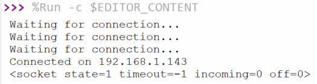

## Otevři soket

V tomto kroku použijete připojení k WLAN k otevření socketu.

{:width="300px"}

Soket je způsob, jakým může **server** naslouchat **klientovi**, který se k němu chce připojit. Webová stránka, kterou si právě prohlížíš, je hostována na serverech Raspberry Pi Foundation. Tyto servery mají otevřený socket, který čeká na připojení tvého webového prohlížeče, načež je obsah webové stránky odeslán do tvého počítače. V tomto případě bude serverem Raspberry Pi Pico W a klientem bude webový prohlížeč na jiném počítači.

Pro otevření socketu je nutné zadat IP adresu a číslo portu. Čísla portů používají počítače k identifikaci, kam by měly být požadavky odesílány. Například port `80` se obvykle používá pro webový provoz; Stardew Valley používá port `24642`, když hraješ hru pro více hráčů. Při nastavování webového serveru budete používat port `80`.

--- task ---

Vytvoř novou funkci, kterou lze zavolat pro otevření socketu. Začni tím, že socketu přidělíš IP adresu a číslo portu.

--- code ---
---
language: python
filename: web_server.py
line_numbers: true
line_number_start: 35
line_highlights: 
---
def open_socket(ip):
    # Otevři soket
    address = (ip, 80)

connect()

--- /code ---

--- /task ---

--- task ---

Nyní vytvoř socket a nech ho naslouchat požadavkům na portu `80`. Nezapomeň zavolat funkci na konci kódu.

--- code ---
---
language: python
filename: web_server.py
line_numbers: true
line_number_start: 35
line_highlights: 38-41
---
def open_socket(ip):
    # Otevři soket
    address = (ip, 80)
    connection = socket.socket()
    connection.bind(address)
    connection.listen(1)
    print(connection)

ip = connect()
open_socket(ip)

--- /code ---

--- /task ---

--- task ---

**Test:** Spusť kód a měl bys vidět výstup, který vypadá nějak takto.

--- code ---
---
language: python
filename: 
line_numbers: false
line_number_start: 
line_highlights: 
---
>>> %Run -c $EDITOR_CONTENT
Čekání na připojení...
Čekání na připojení...
Čekání na připojení...
Čekání na připojení...
Čekání na připojení...
Připojeno k 192.168.1.143
<socket state=1 timeout=-1 incoming=0 off=0>

--- /code ---

`socket state=1` ti říká, že tvůj socket funguje.

--- /task ---

--- task ---

Nakonec nahraď `print` `return` a poté ulož vrácené socketové připojení jako proměnnou.

--- code ---
---
language: python
filename: web_server.py
line_numbers: true
line_number_start: 35
line_highlights: 41, 46
---
def open_socket(ip):
    # Otevři soket
    address = (ip, 80)
    connection = socket.socket()
    connection.bind(address)
    connection.listen(1)
    return connection

ip = connect()
connection = open_socket(ip)

--- /code ---

--- /task ---

Nyní Raspberry Pi Pico W naslouchá připojením na své IP adrese na portu `80`. To znamená, že je připraven začít zobrazovat HTML kód, aby připojený webový prohlížeč mohl zobrazit webovou stránku.

--- save ---
