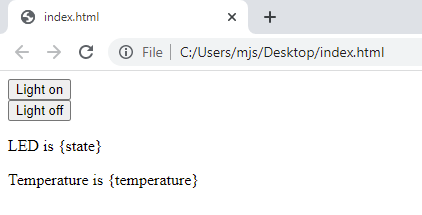
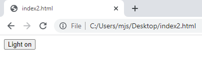
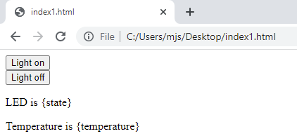

## Vytvoř webovou stránku

V tomto kroku vytvoříš webovou stránku, kterou může webový server běžící na tvém Raspberry Pi Pico W odeslat do klientského webového prohlížeče. Nejprve si ale webovou stránku otestuj na počítači, ať víš, že se zobrazuje tak, jak má. V dalším kroku můžeš přidat kód do svého skriptu v Pythonu, aby Raspberry Pi Pico W mohlo webovou stránku zobrazovat.

Webová stránka může být tak jednoduchá, jako nějaký text, formátovaný tak, aby ji webový prohlížeč vykreslil a poskytoval určitou interaktivitu. Ačkoliv Thonny není určen pro psaní HTML, lze jej k tomuto účelu použít. Můžeš však použít svůj preferovaný textový editor, pokud chceš, ať už je to VSCode, TextEdit nebo Poznámkový blok.

--- task ---

V textovém editoru nebo v Thonny vytvoř nový soubor. Můžeš jej nazvat, jak chceš, ale `index.html` je standardní název pro první stránku, se kterou uživatel interaguje. Nezapomeň přidat příponu souboru `.html`. Pokud používáš Thonny, nezapomeň soubor uložit do složky **Tento počítač**.

--- /task ---

--- task ---

Existuje určitý standard pro HTML kód, který budeš muset respektovat.

--- code ---
---
language: html
filename: index.html
line_numbers: true
line_number_start: 
line_highlights: 
---
<!DOCTYPE html>
<html>
<body>
</body>
</html>

--- /code ---

--- /task ---

--- task ---

Dále můžeš vytvořit tlačítko, které bude sloužit k zapnutí nebo vypnutí integrované LED diody.

--- code ---
---
language: html
filename: index.html
line_numbers: true
line_number_start: 
line_highlights: 4-6
---
<!DOCTYPE html>
<html>
<body>
<form action="./lighton">
<input type="submit" value="Light on" />
</form>
</body>
</html>

--- /code ---

--- /task ---

--- task ---

Ulož soubor a poté jej vyhledej ve správci souborů. Po dvojitém kliknutí na soubor by se měl otevřít ve výchozím webovém prohlížeči. Takto vypadá webová stránka v prohlížeči Google Chrome.

--- /task ---

--- task ---

Přidej druhé tlačítko pro vypnutí LED diody.

--- code ---
---
language: html
filename: index.html
line_numbers: true
line_number_start: 
line_highlights: 7-9
---
<!DOCTYPE html>
<html>
<body>
<form action="./lighton">
<input type="submit" value="Light on" />
</form>
<form action="./lightoff">
<input type="submit" value="Light off" />
</form>
</body>
</html>

--- /code ---

--- /task ---

--- task ---

Lze přidat další tlačítko pro zavření webového serveru, aniž bys musel používat Thonny.

--- code ---
---
language: html
filename: index.html
line_numbers: true
line_number_start: 
line_highlights: 10-12
---
<!DOCTYPE html>
<html>
<body>
<form action="./lighton">
<input type="submit" value="Light on" />
</form>
<form action="./lightoff">
<input type="submit" value="Light off" />
</form>
<form action="./close">
<input type="submit" value="Stop server" />
</form>
</body>
</html>

--- /code ---

--- /task ---

--- task ---

Pro dokončení webové stránky můžeš přidat další data, jako je stav LED diody a teplota tvého Raspberry Pi Pico W.

--- code ---
---
language: html
filename: index.html
line_numbers: true
line_number_start: 
line_highlights: 13-14
---
<!DOCTYPE html>
<html>
<body>
<form action="./lighton">
<input type="submit" value="Light on" />
</form>
<form action="./lightoff">
<input type="submit" value="Light off" />
</form>
<form action="./close">
<input type="submit" value="Stop server" />
</form>

LED dioda je {state}

Teplota je {temperature}

</body>
</html>

--- /code ---

Tvá webová stránka by měla vypadat takto:

--- /task ---

Nyní, když máš funkční webovou stránku, můžeš přidat tento kód do skriptu Pythonu. Nejdříve se budeš muset přepnout zpět na kód Pythonu v Thonny.

--- task ---

Vytvoř novou funkci s názvem `webpage`, která má dva parametry. Jedná se o `temperature` a `state`.

--- code ---
---
language: python
filename: web_server.py
line_numbers: true
line_number_start: 44
line_highlights: 
---
def webpage(temperature, state):
    #Template HTML

--- /code ---

--- /task ---

--- task ---

Nyní můžeš veškerý napsaný a otestovaný HTML kód uložit do proměnné. Použití **fstrings** pro text znamená, že zástupné symboly, které máte v HTML pro `temperature` a `state`, lze vložit do tvého řetězce.

--- code ---
---
language: python
filename: web_server.py
line_numbers: true
line_number_start: 44
line_highlights: 46-62
---
def webpage(temperature, state):
    #Template HTML
    html = f"""
            <!DOCTYPE html>
            <html>
            <form action="./lighton">
            <input type="submit" value="Light on" />
            </form>
            <form action="./lightoff">
            <input type="submit" value="Light off" />
            </form>
            <form action="./close">
            <input type="submit" value="Stop server" />
            </form>
            
LED dioda je {state}

            
Teplota je {temperature}

            </body>
            </html>
            """

--- /code ---

--- /task ---

--- task ---

Nakonec můžeš z funkce vrátit řetězec `html`.

--- code ---
---
language: python
filename: web_server.py
line_numbers: true
line_number_start: 44
line_highlights: 63
---
def webpage(temperature, state):
    #Template HTML
    html = f"""
            <!DOCTYPE html>
            <html>
            <form action="./lighton">
            <input type="submit" value="Light on" />
            </form>
            <form action="./lightoff">
            <input type="submit" value="Light off" />
            </form>
            
LED dioda je {state}

            
Teplota je {temperature}

            </body>
            </html>
            """
    return str(html)

--- /code ---

--- /task ---

--- save ---

Tento kód zatím nemůžeš otestovat, protože program zatím nezobrazuje HTML kód. To bude řešeno v dalším kroku.

Jednoduchý HTML kód, který máš právě napsaný, bude uložen ve skriptu MicroPython a zobrazen prohlížeči všech počítačů, které se k němu připojují přes síť, stejně jako webová stránka uložená na jakémkoli jiném serveru na světě. Důležitým rozdílem je, že k webové stránce mohou přistupovat nebo ovládat Raspberry Pi Pico W pouze zařízení připojená k vaší WiFi síti. Tato stránka je velmi jednoduchou ukázkou toho, co je možné. Chceš-li se dozvědět více o kódování HTML a tvorbě webových stránek, podívej se na některé z našich [dalších projektů na tomto webu!](https://projects.raspberrypi.org/cs-CZ/collections/html_and_css)

