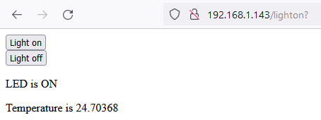
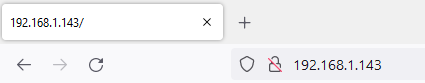

## Poskytni svou webovou stránku

<div style="display: flex; flex-wrap: wrap">
<div style="flex-basis: 200px; flex-grow: 1; margin-right: 15px;">
V tomto kroku spustíš webový server, aby se k němu mohl připojit klient, ovládat LED diodu a odečítat teplotu.
</div>
<div>

</div>
</div>

--- task ---

Vytvoř funkci, která spustí webový server, pomocí objektu `connection` uloženého jako parametr. Proměnné `state` a `temperature` musí být nastaveny pro HTML data. Stav začne tak, že bude nastaven na `'OFF'`, a na `0`, což znamená, že bys měl také zajistit, že LED bude vypnuta při startu serveru.

--- code ---
---
language: python
filename: web_server.py
line_numbers: true
line_number_start: 66
line_highlights:
---
def serve(connection):
    # Spuštění webového serveru
    state = 'OFF'
    pico_led.off()
    temperature = 0

--- /code ---

--- /task ---

Pokud webový prohlížeč požádá o připojení k tvému Raspberry Pi Pico W, připojení musí být přijato. Poté musí být data odesílaná z webového prohlížeče odeslána v určitých částech (v tomto případě 1024 bajtů). Také potřebuješ vědět, jaký požadavek tvůj webový prohlížeč odesílá – žádá jen o jednoduchou stránku? Žádá o stránku, která neexistuje?

--- task ---

Chceš, aby webový server byl neustále v provozu a naslouchal, aby se k němu mohl připojit jakýkoli klient. Toho lze dosáhnout přidáním smyčky `while True:`. Přidej těchto pět řádků kódu, abys mohl přijmout požadavek, a pomocí funkce `print()` zjistit, o jaký požadavek se jednalo. Přidej volání funkce `serve` do volání na konci kódu.

--- code ---
---
language: python
filename: web_server.py
line_numbers: true
line_number_start: 66
line_highlights: 71-76, 81
---
def serve(connection):
    # Spuštění webového serveru
    state = 'OFF'
    pico_led.off()
    temperature = 0
    while True:
        client = connection.accept()[0]
        request = client.recv(1024)
        request = str(request)
        print(request)
        client.close()


ip = connect()
connection = open_socket(ip)
serve(connection)

--- /code ---

--- /task ---

**Test:** Spusť program a poté zadej IP adresu do adresního řádku webového prohlížeče v počítači.



Ve výstupu shellu v Thony bys měl vidět něco podobného.

```python
>>> %Run -c $EDITOR_CONTENT
Čekání na připojení...
Čekání na připojení...
Čekání na připojení...
Připojeno k 192.168.1.143
b'GET / HTTP/1.1\r\nHost: 192.168.1.143\r\nUser-Agent: Mozilla/5.0 (Windows NT 10.0; Win64; x64; rv:101.0) Gecko/20100101 Firefox/101.0\r\nAccept: text/html,application/xhtml+xml,application/xml;q=0.9,image/avif,image/webp,*/*;q=0.8\r\nAccept-Language: en-GB,en;q=0.5\r\nAccept-Encoding: gzip, deflate\r\nConnection: keep-alive\r\nUpgrade-Insecure-Requests: 1\r\n\r\n'
b'GET /favicon.ico HTTP/1.1\r\nHost: 192.168.1.143\r\nUser-Agent: Mozilla/5.0 (Windows NT 10.0; Win64; x64; rv:101.0) Gecko/20100101 Firefox/101.0\r\nAccept: image/avif,image/webp,*/*\r\nAccept-Language: en-GB,en;q=0.5\r\nAccept-Encoding: gzip, deflate\r\nConnection: keep-alive\r\nReferer: http://192.168.1.143/\r\n\r\n'
```

--- task ---

Dále je třeba odeslat napsaný HTML kód do webového prohlížeče klienta.

--- code ---
---
language: python
filename: web_server.py
line_numbers: true
line_number_start: 66
line_highlights: 76, 77
---
def serve(connection):
    # Spuštění webového serveru
    state = 'ON'
    pico_led.on()
    temperature = 0
    while True:
        client = connection.accept()[0]
        request = client.recv(1024)
        request = str(request)
        print(request)
        html = webpage(temperature, state)
        client.send(html)
        client.close()


ip = connect()
connection = open_socket(ip)
serve(connection)

--- /code ---

--- /task ---

--- task ---

Po opětovném spuštění kódu obnov stránku. Klikni na zobrazená tlačítka. V Thonny bys pak měl vidět, že z tvého shellu existují dva různé výstupy.

```python
b'GET /lighton? HTTP/1.1\r\nHost: 192.168.1.143\r\nUser-Agent: Mozilla/5.0 (Windows NT 10.0; Win64; x64; rv:101.0) Gecko/20100101 Firefox/101.0\r\nAccept: text/html,application/xhtml+xml,application/xml;q=0.9,image/avif,image/webp,*/*;q=0.8\r\nAccept-Language: en-GB,en;q=0.5\r\nAccept-Encoding: gzip, deflate\r\nConnection: keep-alive\r\nReferer: http://192.168.1.143/\r\nUpgrade-Insecure-Requests: 1\r\n\r\n'
```

a

```python
b'GET /lightoff? HTTP/1.1\r\nHost: 192.168.1.143\r\nUser-Agent: Mozilla/5.0 (Windows NT 10.0; Win64; x64; rv:101.0) Gecko/20100101 Firefox/101.0\r\nAccept: text/html,application/xhtml+xml,application/xml;q=0.9,image/avif,image/webp,*/*;q=0.8\r\nAccept-Language: en-GB,en;q=0.5\r\nAccept-Encoding: gzip, deflate\r\nConnection: keep-alive\r\nReferer: http://192.168.1.143/lighton?\r\nUpgrade-Insecure-Requests: 1\r\n\r\n'
```

--- /task ---

Všimni si, že v požadavcích máš `/lighton?`, `lightoff?` a `close?`. Tyto prvky lze použít k ovládání integrované LED diody vašeho Raspberry Pi Pico W a k vypnutí serveru.

--- task ---

Rozděl řetězec požadavku a poté načti první položku v seznamu. Někdy nemusí být možné řetězec požadavku rozdělit, takže je nejlepší to řešit pomocí `try`/`except`.

Pokud je první položka v rozdělení `lighton?`, pak můžeš LED diodu rozsvítit. Pokud je to „lightoff?“, můžeš LED diodu vypnout. Pokud je to `close?`, můžeš provést `sys.exit()`

--- code ---
---
language: python
filename: web_server.py
line_numbers: true
line_number_start: 66
line_highlights: 75-85
---
def serve(connection):
    # Spuštění webového serveru
    state = 'ON'
    pico_led.on()
    temperature = 0
    while True:
        client = connection.accept()[0]
        request = client.recv(1024)
        request = str(request)
        try:
            request = request.split()[1]
        except IndexError:
            pass
        if request == '/lighton?':
            pico_led.on()
        elif request =='/lightoff?':
            pico_led.off()
        elif request == '/close?':
            sys.exit()  
        html = webpage(temperature, state)
        client.send(html)
        client.close()

--- /code ---

--- /task ---

--- task ---

Spusť svůj kód znovu. Tentokrát, když obnovíš okno prohlížeče a klikneš na tlačítka, měla by se integrovaná LED rozsvítit a zhasnout. Pokud klikneš na tlačítko **Stop Server**, tvůj server by se měl vypnout.

--- /task ---

--- task ---

Můžeš také uživateli webové stránky sdělit, jaký je stav LED.

--- code ---
---
language: python
filename: web_server.py
line_numbers: true
line_number_start: 66
line_highlights: 81, 84
---
def serve(connection):
    # Spuštění webového serveru
    state = 'ON'
    pico_led.on()
    temperature = 0
    while True:
        client = connection.accept()[0]
        request = client.recv(1024)
        request = str(request)
        try:
            request = request.split()[1]
        except IndexError:
            pass
        if request == '/lighton?':
            pico_led.on()
            state = 'ON'
        elif request =='/lightoff?':
            pico_led.off()
            state = 'OFF'
        elif request == '/close?':
            sys.exit() 
        html = webpage(temperature, state)
        client.send(html)
        client.close()

--- /code ---

Nyní, když spustíš kód, měl by se na aktualizované webové stránce změnit i text pro stav LED diody.

--- /task ---

--- task ---

Nakonec můžeš pomocí integrovaného teplotního senzoru získat přibližnou hodnotu teploty procesoru a zobrazit ji také na své webové stránce.

--- code ---
---
language: python
filename: web_server.py
line_numbers: true
line_number_start: 66
line_highlights: 87
---
def serve(connection):
    # Spuštění webového serveru
    state = 'ON'
    pico_led.on()
    temperature = 0
    while True:
        client = connection.accept()[0]
        request = client.recv(1024)
        request = str(request)
        try:
            request = request.split()[1]
        except IndexError:
            pass
        if request == '/lighton?':
            pico_led.on()
            state = 'ON'
        elif request =='/lightoff?':
            pico_led.off()
            state = 'OFF'
        elif request == '/close?':
            sys.exit() 
        temperature = pico_temp_sensor.temp
        html = webpage(temperature, state)
        client.send(html)
        client.close()

--- /code ---

--- /task ---

--- task ---

**Test:** Můžeš podržet ruku nad Raspberry Pi Pico W, abys zvýšil jeho teplotu, a poté aktualizovat webovou stránku v počítači, abys viděl nově zobrazenou hodnotu.

--- /task ---

